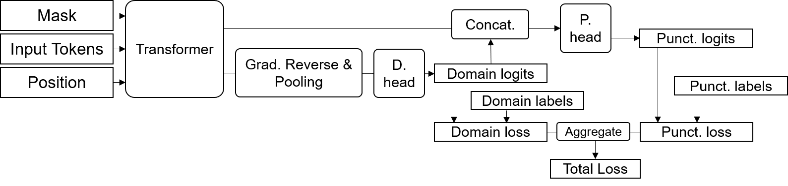

# Domain Transfer for punctuation retrieval

## Credits
My research adapted code from [Nvidia NeMo](https://github.com/NVIDIA/NeMo), [PyTorch Lightning](https://www.pytorchlightning.ai/) and [Hugging Face](https://huggingface.co/).

## Navigating this repository (Other files not listed other than those in the experiment/core folder can be ignored)

```bash
project
└───Punctuation_with_Domain_discriminator/results/ : results referenced in report.
│
│   README.md      : This file
│   processcsv.py  : preprocess raw csv $ python ~/project/processcsv.py -i sourcepath.csv -o sourcepath_processed.csv -c 2000 (process in chunks of 2000)
│   processxml.py  : helper script for bin/xml2csv.sh
│   setup.sh       : sample script for setting up project environment. Change the CUDA version before running
│   .gitignore
│   NLP.yml        : conda environment. (I use setup.sh instead)
│   
└───experiment
    │   main.py     : entrypoint for training  $ python main.py    // Set configs in config.yaml
    │   config.yaml : main config file for setting all hparams
    │   info.log    : autogenerated. ignore
    │   testing.py  : script for testing. $ python testing.py // Either test a csv, perform inference on list of text, or take input from commmandline
    │                 (Set path to model ckpt file and comment out relavant section in file before running)
    │   
    └───models
    │   │   punctuation_domain_model.py   : main code for PunctuationDomainModel
    │   
    └───data	: extra scripts for dataprocessing
    │   │   punctuation_datamodule.py  : PyTorch Lightning Datamodule for model
    │   │   punctuation_dataset_multi.py  : PyTorch Dataset code for training and inference
    │   │   punctuation_count.sh  : View punctuation distribution for files
    │   │   explode.py  : Split long examples into shorter lengths at sentence boundaries
    │   │   get-data.sh     : Script for getting initial dataset before preprocessing. Get from kaggle instead
    │   │   percsplit.sh    : helper for processandsplit.sh
    │   │   processandsplit.sh  : Split csv into 3 files $ bash ~/project/experiment/data/processandsplit.sh csvfilepath 8 1 1 (train dev test)
    │   │   processpipeline.sh  : Outdated. Get dataset from kaggle instead
    │   │   shuffle.sh  : helper script to sort or shuffle csv file with seed
    │   │   xml2csv.sh  : Crawl opensubtitles folders and extract text from xml to a single csv file.
    │   │   utt2csv.sh  : Preprocess switchboard utterance version to csv.
    │   │   disfl2csv.sh  : Preprocess switchboard disfluency version to csv. Unused
    │   │   processdff.py or processutt.py : Processing code for disfl2csv.sh and utt2csv.sh.
    │   │   lrec2csv.py : Unused
    │
    └───core    : scripts used by PunctuationDomainModel/Dataset etc.

```

## Navigating the config file (paramaters to tune)

``` console
seed: Global seed for all random generators
inference: Set as false. Ignore. Used by model to determine if config file is for training or inference. Saved hparams.yaml will set as true
trainer: uncomment code for cpu or gpu depending on your intent.
    max_epochs: Number or epochs per layer unfrozen
    accumulate_grad_batches: 
    gradient_clip_val: Avoid exploding gradients
    val_check_interval: How often model is validated (Set to 0.25 to check 4 times per epoch, 1.0 for normal, or an int for number of iterations)
exp_manager:
    exp_dir: /home/${env:USER}/project/ # The location of the project for the experiment hparams and checkpoints to be saved.
    name: Punctuation_with_Domain_discriminator  # The name of your model (exp logs will be saved in this folder with this name)
    create_tensorboard_logger: true  Keep this as true, if not some things won't be saved
base_path: location of data source files
tmp_path: location of tmp directory to store the tmp files generated (shuffle or low resource splits)
model:
    transformer_path: set to huggingface model name (passed into AutoModel, AutoTokenizer etc.)
    unfrozen: Initial number of layers unfrozen
    maximum_unfrozen: maximum number of layers unfrozen
    unfreeze_step: layers to unfreeze after each max_epochs trained
    punct_label_ids: The set of labels to be considered (exclude no-space)
    label_map: Punctuation to be replaced by those in the punct_label_ids. Punctuation not in punct_label_ids will be treated as subword tokens.
    no_space_label: Use '' to not differentiate between space and no-space, Use '#' to differentiate, ignore if attach_label_to_end is not None
    test_chunk_percent: Ignore. Not used
    punct_class_weight_factor: gamma term for DL, FL, CEL. not used for CRF
    punct_class_weights: Auto generated based on punct_class_weight_factor. Leave blank
    cat_domain_and_states: (bool) Whether to concat domain output and hidden states
    cat_domain_logits: (bool) concat the domain logits. if false, concat the pooled output. Ignore if cat_domain_and_states is false. Just leave as true
    dataset:
        data_dir: data directory
        labelled: List of labelled dataset (without split or extension) to be included.
        unlabelled: List of unlabelled dataset to be included. (Only ${low_resource_labelled_count} examples will be labelled).)
    low_resource_labelled_count: (int) Number or examples to be labelled for unlabelled datasets
    max_seq_length: length of window
    pad_label: unused
    num_workers: number of cpu threads for each dataloader.
    num_labels: auto generated
    num_domains: auto generated
    val_unlabelled: (bool) Check labelled+unlabelled val set (false) or just unlabelled val set (true). default true
    test_unlabelled: same as val_unlabelled
    attach_label_to_end: false - attach to start, true - attach to end, blank - attach to individual subwords
    
    alpha_* : augmentation probability
    stride: 0 if no stride, integer < max_seq_length if stride
    train_ds:
        batch_size: batch_size for each domain
        manual_len: 0 if use everything, int to just take a subset of the dataset per epoch, used for huge dataset
    
    punct_head:
        dice_loss or focal_loss : Just care about the loss that you use, ignore the other one.
    domain_head:
        gamma: Leave blank. filled during train time
        gamma_factor: Gradient reversal coefficient
        pooling: 'attention' or 'mean' or 'mean_max' or 'token' or 'attention' or leave blank (no pooling)
        idx_conditioned_on: which token to consider when using token pool. Leave as 0
        weight_tokens: Weigh domain based on domain class weight below
        weight: default to even distribution, Ensure length is the same as the number of domains.
        
        
```

## Datasources

The chosen datasources for this project are:

1. [TED \- Ultimate Dataset \| Kaggle](https://www.kaggle.com/miguelcorraljr/ted-ultimate-dataset) \- A collection of 4005 TED talks.
2. [Untokenised Corpus files for Opensubtitles](http://opus.nlpl.eu/OpenSubtitles-v2018.php) \- Select the rightmost column language ID\, in my case en\.
3. [Switchboard corpus](https://catalog.ldc.upenn.edu/docs/LDC97S62/swb1_dialogact_annot.tar.gz) \- Concatenate all telephone conversations

## Preprocessing

The following steps are taken for preprocessing the data to a useable form.

1. Remove speaker tags or tags that are added for better readability, such as sound effects e.g.  (Narrator:  ) or (Applause).
2. Identify spoken text that are within square or round brackets and remove the brackets.
3. Remove music lyrics bounded by music note symbols i.e. `♫ Lyrics ♫` as they contain minimal punctuation information.
4. Remove empty matching tags - square brackets, parentheses, single/double quotes. Remove empty matching tags: square brackets, parentheses, single or double quotes as they are not covered under the scope of this research.
5. Convert ellipsis to the unicode version.
6. Removing Non-sentence punctuation (All punctuation that are non-readable (not @$#%&^+=€²£¥) ).
7. Replace en-dash with hyphen
8. Combining repeated patterns of punctuation, i.e. [. .] to [.], [!!!!] to [!].
9. Pronounce common symbols such as * to times, or 5.0 to 5 point 0
10. Remove excess white-spaces
11. Sort the entire corpus by chronological order
12. Remove duplicates
13. Perform train development test split of 0.8 0.1 0.1.
14. Split large document into smaller size (e.g. chunks of around 1500 characters at sentence boundaries) to reduce size difference between examples. $ python ~/project/experiment/data/explode.py -i open_subtitles_processed.csv -o open_subtitles_explode.csv -l 1500 -s 0

## Processing part-2

**The punctuation to be classified are as follows**:
{0: '', 1: '!', 2: ',', 3: '-', 4: '.', 5: ':', 6: ';', 7: '?', 8: '—', 9: '…'} with 8 being the emdash. Certain mapping of labels such as replacing all '!' with periods were performed when training the model, and this mapping can be defined in the configuration file.

There are occurences of consecutive punctuation. This includes:

1. `.,` : period after abbreviation or initial
2. `?,` or `!—` etc. where the first punctuation applies to a local scope and the 2nd applies to a larger context.
3. anomalies i.e. ?! or !! or even a hyphen leading the next sentence

In most cases, it makes more sense to classify the punctuations from right to left, so for this project I'll just consider the punctuation at the right:

The process of converting continuous text to a form to be input into the model is as follows (text2mask function):

1. Taking the text and degree (0 being the punctuation at the right), convert the text into 2 lists - the first being a list of words, and the second being a list of previously classified punctuations or spaces dividing the text. (i.e. when degree is 0, the 2nd list contains all empty strings.)
2. Intialize 2 new lists, a and b. Process both lists alternately beginning with the words list, identifying the trailing punctuation and stripping all punctuations from the tail. The word will be appended to a and the id of the punctuation identified will be appended to b.

For a better idea of the entire preprocessing pipeline, refer to the file ```./experiment/data/punctuation_datamodule.py``` and all modules that it references. 

### Environment setup

``` console
# After changing the cudatoolkit version based on your GPU
$ . ./setup.sh
```

### Preprocessing commands

You can either manually process the raw data files or obtain the preprocessed version from kaggle. 

From scratch:
``` console
$ bash ~/project/get-data.sh

# Switchboard to csv
$ bash ~/project/experiment/data/disfl2csv.sh /home/nxingyu/data/LDC99T42/treebank_3/dysfl/dff/swbd /home/nxingyu/data/switchboard_processed.csv
$ bash ~/project/experiment/data/utt2csv.sh /home/nxingyu/data/utt /home/nxingyu/data/switchboardutt_processed.csv


# Preprocess csv
$ python ~/project/processcsv.py -i ~/data/switchboardutt_processed.csv -o ~/data/switchboardutt_processed.csv -c 2000
$ python ~/project/processcsv.py -i ~/data/switchboard_processed.csv -o ~/data/switchboard_processed.csv -c 2000
$ python ~/project/processcsv.py -i ~/data/ted_talks_en.csv -o ~/data/ted_talks_processed.csv -c 2000
$ python ~/project/processcsv.py -i ~/data/open_subtitles.csv -o ~/data/open_subtitles_processed.csv -c 2000
```

### Preprocessed data from kaggle
Get preprocessed dataset from kaggle (Using kaggle api or downloading from [here](https://www.kaggle.com/ngxingyu/preprocessed-english-spoken-transcripts))
```bash
$ kaggle datasets download -d ngxingyu/preprocessed-english-spoken-transcripts
$ unzip preprocessed-english-spoken-transcripts.zip
$ mv *.csv ~/data/
```

### Pretrained Model
Get *sample pretrained model* to try (extract to Punctuation_with_Domain_discriminator folder and set exp='pretrained' in testing.py and uncomment the relavant part to try)
Pre-trained with domain method. **** Edit the hparams.yaml file in the pretrained folder, changing all mentions of nxingyu2 to your username.

[4 punctuation (https://drive.google.com/uc?id=1e93ZnWChouoy4kC5CZ9gihZ4UPOAiUfY)](https://drive.google.com/uc?id=1e93ZnWChouoy4kC5CZ9gihZ4UPOAiUfY)

[8 punctuation - Not as good as 4 (https://drive.google.com/uc?id=1sN-arbazKzauHSMtCcO3SdN1yiS_GU3Y)](https://drive.google.com/uc?id=1sN-arbazKzauHSMtCcO3SdN1yiS_GU3Y)

```bash
$ cd ???/Punctuation_with_Domain_discriminator
$ gdown <insert URL here>
$ tar -xf punctuation.tar.xz
```

Further processing to setup dataset to be fed into model. (Split, explode, generate low-resource dataset.)
* The difference between switchboardutt_processed.train.csv and switchboardutt_processedlow.train.csv is the switchboardutt_processedlow only contains the 2 labelled examples for training, while switchboardutt_processed.train.csv contains all 80% of labelled examples for training, and is meant for training using unlabelled train examples. 

``` console
# Remove header
# Split train dev test
# Explode to reduce length (splits every 1500+ characters at a sentence punctuation mark. the final chunk < 2500 characters will just be taken as it is.)
# Rename explode dataset with original name
# Insert header for preprocessed dataset
# Adapt filenames to the different datasets

sed -i 1d open_subtitles_processed.csv
bash ~/project/experiment/data/processandsplit.sh ./open_subtitles_processed.csv 8 1 1
python ~/project/experiment/data/explode.py -i open_subtitles_processed.csv -o open_subtitles_explode.csv -l 1500 -s 0
find . -name 'open_subtitles_explode.*.csv' -exec bash -c ' mv $0 ${0/explode/processed}' {} \;
sed -i 1i"id,transcript" open_subtitles_processed*


# Create low resource switchboard dataset (set NR<= 1+number of lines) for training with low resource labelled without low resource unlabelled examples (i.e. when the gradient reversal gamma factor is 0)
$ awk 'NR==1 || NR<=3' switchboardutt_processed.train.csv > switchboardutt_processedlow.train.csv
$ cp switchboardutt_processed.dev.csv switchboardutt_processedlow.dev.csv
$ cp switchboardutt_processed.test.csv switchboardutt_processedlow.test.csv

<!-- kaggle datasets version -m 'message' -->
```


### Running Experiments

#### To train:
From the experiment directory,
Update the config.yaml file
Run ```python main.py```, specifying any specific GPU if needed.

#### To view logs:
Run ```tensorboard serve --logdir diroflogs```

#### To evaluate experiment:
** Edit the testing.py code **
Update the experiment folder name containing the .ckpt file in experiment/testing.py
Uncomment the relavant section of code based on the intended task: evaluating the test set, performing inference on the list of test, and performing inference based on input from commandline.
Run ```python testing.py```


## Model presented in research



## Observations

Experiments on Switchboard corpus, performing hparams tuning on the following: (CEL, FL, DL with MLP or CRF).
Result: 
- Dice Loss performed decently, was robust to punctuation class imbalance.
- Domain adversarial method was effective for domain transfer to low-resource domain (Switchboard), and slightly effective for zero-resource domain.


<!-- ## Log for 26/1/2020

Found a bug in regex pattern: A-z also includes punctuation characters, use A-Za-z instead.
Worked on creating the model in python instead of ipynb.

## Log for 27/1/2020

Use code-server

``` console
user@instance:~$ fuser -k 9999/tcp
user@instance:~$ code-server --bind-addr 127.0.0.1:9999 --auth none &
```

To convert all to lowercase.
To strip leading before first Uppercase, after last sentence punctuation.

Repeated starts are possible i.e. similar show but different episodes. Perhaps better to remove the shuffling and just split by order? yes. I'll do this instead.

Some of the regexes are flawed, to check if spare time?

Convert from huggingface load dataset which loads all to memory to pandas chunking map save.

## Log for 28/1/2020

Found an arabic character in one of the texts "Co ِ perative" which broke the tokenizer parsing. To go through the preprocessing step in greater detail now.

## Log for 2/2/2020

Converted torch Dataset into IterableDataset with chunks, for faster loading. Each batch features a ConcatDataset looking at all children datasets which are cycled using itertools.cycle. They run until the largest batch size is fully covered.

To implement:

* Random shuffling of csv dataset each batch.
* Look at effectiveness of Dice Loss and possible hyperparameters which can improve its F score.
* Evaluate the effectiveness of smaller models -->

<!-- Git issues:

``` console
git filter-branch -f --index-filter 'git rm -rf --cached --ignore-unmatch ./experiment/nemo_experiments/Punctuation_with_Domain_discriminator/*' --tag-name-filter cat -- --all
git rev-list --objects --all |   git cat-file --batch-check='%(objecttype) %(objectname) %(objectsize) %(rest)' |   sed -n 's/^blob //p' |   sort --numeric-sort --key=2 |   cut -c 1-12,41- |   $(command -v gnumfmt || echo numfmt) --field=2 --to=iec-i --suffix=B --padding=7 --round=nearest
git gc --prune=now
``` -->
